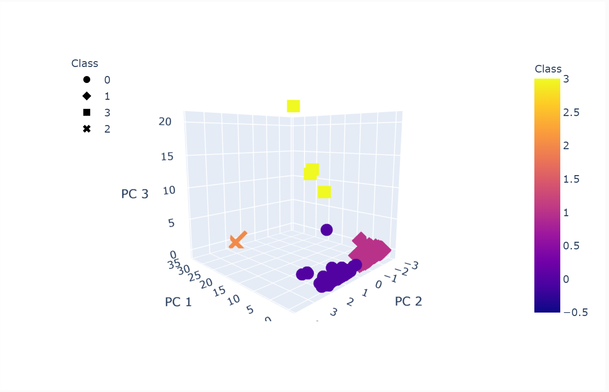
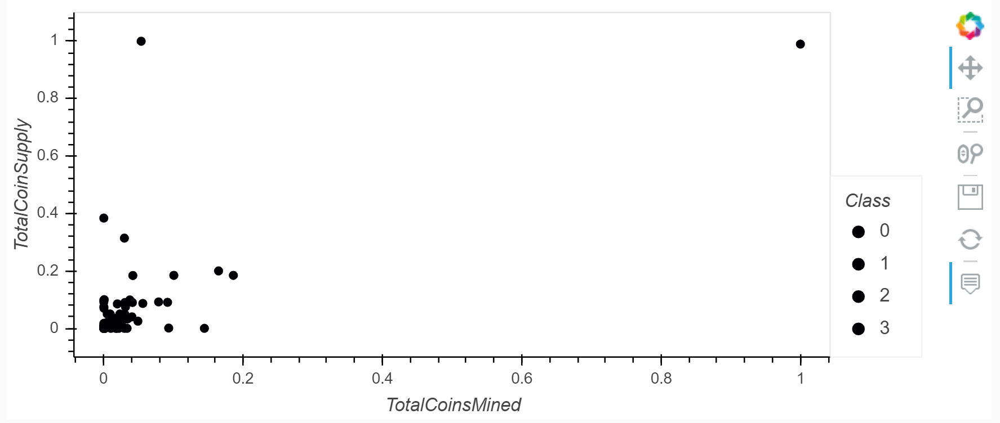

# Cryptocurrencies

> Unsupervised Machine Learning with Cryptocurrencies

Photo by <a href="https://unsplash.com/@launchpresso?utm_source=unsplash&amp;utm_medium=referral&amp;utm_content=creditCopyText">Launchpresso</a> on <a href="https://unsplash.com/s/photos/cryptocurrencies?utm_source=unsplash&amp;utm_medium=referral&amp;utm_content=creditCopyText">Unsplash</a>

## Overview

A prominent investment bank is interested in offering a new cryptocurrencies investment portfolio for its customers, however, they are lost in the immense universe of cryptocurrencies. They ask you to help them make sense of it all by generating a report of what cryptocurrencies are available on the trading market and how they can be grouped using classification. They’ve asked you to create a report that includes what cryptocurrencies are on the trading market and how they could be grouped to create a classification system for this new investment.

## Summary

Prepare data for dimension reduction with PCA and clustering using K-Means. We've also reduced data dimensions using PCA and the completion of this task results in the df_crypto_scaled_pca dataframe:

Then we've clustered cryptocurrencies using K-Means; first creating an Elbow Curve to find the best value for k. Once we've determined the k value we thought best fits, we've used the k-means clustering algorithm to the predict the k clusters for the processed data. Results are:

### Resources

Data: https://min-api.cryptocompare.com/data/all/coinlist
Data ETL: crypto_data_download.ipynb notebook
Data Preprocessing & Analysis: crypto_clustering.ipynb notebook

## Analysis

- A 3D-Scatter using hvPlot to plot the clusters.
- Using `hvplot.table` to create a data table with all the current tradable cryptocurrencies.
- Create a scatter plot using `hvplot.scatter`, to present the clustered data about cryptocurrencies having `x="TotalCoinsMined"` and `y="TotalCoinSupply"` to contrast the number of available coins versus the total number of mined coins.

Bitcoin sold out above the types of cryptocurrencies.

## Todo Checklist

A helpful checklist to gauge how your README is coming on what I would like to finish:

- [ ] ETL Pipeline

## Contributing

Pull requests are welcome. For major changes, please open an issue first to discuss what you would like to change.

Please make sure to update tests as appropriate.

## License

[MIT](https://choosealicense.com/licenses/mit/)
